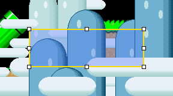
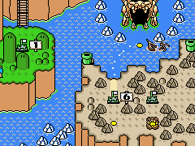

# SMW Editor

> [!NOTE]
> This is a community fork of the [original SMW Editor](https://github.com/SMW-Editor/smw-editor).


SMW Editor is an open-source, multi-platform, modern alternative to Lunar Magic,
providing the tools for SMW romhacking. It is written in Rust with an egui-based
interface and uses a built-in 65816 emulator to decompress and render graphics
directly from the ROM, ensuring accurate visualization of vanilla SMW content.

The project's goal is **Lunar Magic parity** — see
[docs/LUNAR_MAGIC_PARITY.md](docs/LUNAR_MAGIC_PARITY.md) for the full
feature-by-feature parity table.

## Features

### Overworld Editor

- Browse and edit all 7 submaps rendered from composed VRAM tilemaps
- Paint and erase Layer 1 / Layer 2 tiles with a visual picker; tile inspector
  with rendered previews
- Event system: per-event reveal-tile preview toggles, event ownership editing
  (which level/action triggers which event), and Layer 2 event tiles
- Custom level names via the overworld name table, with byte-budget enforcement
- Vanilla-accurate level-number display and Lunar Magic-style reassignment
- Undo/redo; save writes back to the ROM with free-space repointing

### Level Editor

- View, navigate, and edit levels decompressed with the actual game code
- Lunar Magic-style drag handles: drag an object's body to move it, drag one of
  the 8 handles to resize it
- Paint blocks with a Map16 tile picker; Map16 page import/export in Lunar
  Magic-compatible raw format
- Sprite placement with extra bits, a sprite catalog, and a sprite tweaker for
  per-ID behavior
- Primary/secondary header editing, screen exits / secondary entrances, and an
  editable Layer 2 header
- Message box WYSIWYG preview (true SNES font rasterization) plus a text editor
  with per-message byte-budget enforcement
- Named vanilla music track picker
- Lunar Magic `.mwl` level import/export
- ExGFX import/export as PNG
- ROM cross-reference search (find where any address/routine is used)
- Undo/redo

### Other tools

- **Sprite Tile Editor** — place, move, delete, flip, and copy/paste tiles with
  a VRAM browser and palette selection
- **Address Converter** — convert between PC and SNES address spaces, with
  LoROM/HiROM and SMC-header options
- **Render binaries** — command-line tools that render levels and overworld maps
  to PNG files (see below)

### Editor controls (level & overworld)

Both editors share the same controls:

| Key | Action |
|-----|--------|
| `1` | Select mode — click to inspect tiles |
| `2` | Draw mode — pick a tile from the picker, click to paint |
| `3` | Erase mode — click to delete/blank tiles |
| `Scroll wheel` | Zoom |
| `Middle-mouse drag` | Pan |
| `Shift` | Show grid overlay |

The level editor additionally supports:

| Key | Action |
|-----|--------|
| `4` | Probe mode — click to inspect objects |
| `Ctrl+Z` / `Ctrl+Y` | Undo / Redo |
| `Delete` / `Backspace` | Delete selected object |


## Screenshots

Selected object with Lunar Magic-style drag handles:



Animated overworld water/waterfall tile preview:



More screenshots live in [docs/screenshots/](docs/screenshots/).

## Getting started

Make sure you have [rustup](https://rustup.rs/) installed, then build and launch
the editor:

```bash
cargo run --release
```

The editor opens with an empty workspace. Use **File > Open ROM** to load a
Super Mario World ROM (headered or headerless `.smc`/`.sfc`), then open an
editor tab from the **Editors** menu. Recently opened files are remembered
between sessions.

To open a ROM directly from the command line:

```bash
ROM_PATH=/path/to/smw.smc cargo run --release
```

(If `ROM_PATH` is not set, the editor also tries `./smw.smc` in the working
directory.)

> [!IMPORTANT]
> A real SMW ROM is required to use the editor, and it is **never** committed
> to this repository — keep your ROM outside the repo.

### Render binaries

The repository also includes CLI tools for rendering levels and overworld maps
to PNG files (useful for debugging and comparison). They need a ROM via
`--rom`:

```bash
# Render a specific level (hex level number)
cargo run --bin render_level -- --rom=/path/to/smw.smc --level=105 --out=level.png

# Render an overworld submap
cargo run --bin render_ow_submap -- --rom=/path/to/smw.smc --submap=3 --out=forest.png
```

## Testing

```bash
# Unit tests (no ROM needed)
cargo test

# ROM-backed tests: these are #[ignore]d by default and need a real ROM.
# The ROM is read, never modified or committed.
ROM_PATH=/path/to/smw.smc cargo test -p smwe-rom --lib -- --ignored
```

## Technical overview

The editor is structured around a workspace of crates:

- **smwe-emu** — 65816 CPU emulator with WRAM, VRAM, CGRAM, and DMA emulation
- **smwe-rom** — ROM parsing for levels, graphics, Map16, and overworld data
- **smwe-render** — OpenGL tile and palette rendering
- **smwe-widgets** — reusable UI components (VRAM viewer, palette grid)
- **smwe-math** — coordinate type wrappers for consistent math across renderers
- **smwe-bps / smwe-ips** — BPS/IPS patch support
- **wdc65816** — the 65816 CPU core used by the emulator

Rendering is backed by the emulator where possible — levels are decompressed
using the actual game code rather than ad hoc reconstruction, which keeps
visuals synchronized with vanilla SMW behavior.

## Contribution

Contributions are welcome — open an issue or pull request to discuss changes.
Pull requests should include screenshots demonstrating the change (animated GIFs
for anything animated), plus updates to `docs/LUNAR_MAGIC_PARITY.md` where a
parity row is affected.

If you're looking to contribute, experience in any of the following is helpful:
- [Rust](https://www.rust-lang.org/)
- ASM programming for the 65816/SNES
- SMW romhacking and disassembly
- UI design with egui

## License

This project is licensed under the MIT License.
